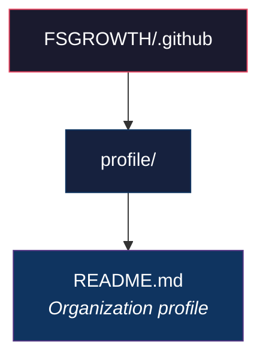
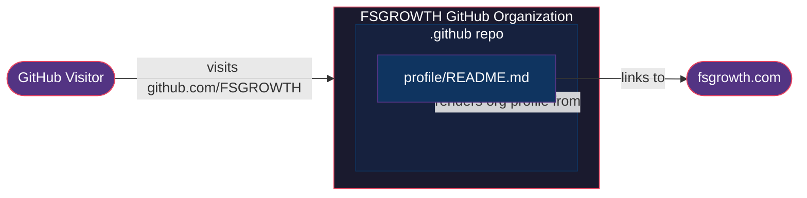

# CLAUDE.md

## Repository Overview

This is the `.github` organization-level repository for **FS Growth** (`FSGROWTH`). It houses the GitHub organization profile and shared configuration.

## Repository Structure

## Architecture Diagram

## What This Repo Does

- **Organization Profile**: `profile/README.md` is rendered on the FSGROWTH GitHub organization page
- **Company**: FS Growth — non-dilutive equipment financing for high-growth tech and life sciences companies
- **Website**: [fsgrowth.com](https://www.fsgrowth.com)

## Development Notes

- This repo has no build steps, CI/CD, or dependencies
- Changes to `profile/README.md` are immediately reflected on the GitHub org page
- Keep the profile concise and on-brand
